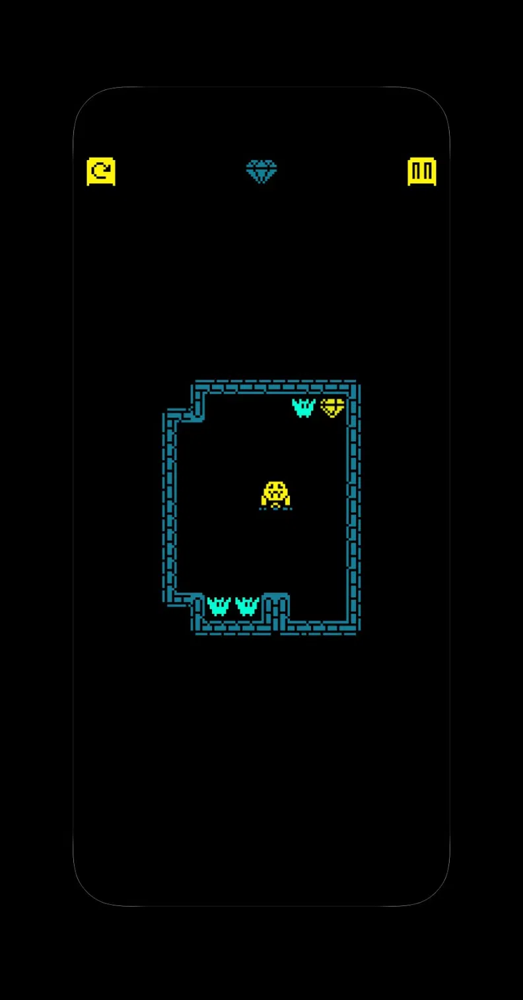

# Gems Seeker Bot

A macOS bot for the Gem Seeker minigame from Tomb of the Mask+.

It captures the game window, reads the board from a few frames, solves the level, and replays the winning move sequence as swipe gestures.



## What it does

- Locates and activates the mirrored phone window with native macOS APIs.
- Captures the window through a ScreenCaptureKit window filter directly as RGB
  pixels, with stable black pixels outside its rounded corners.
- Parses the board from 1 to 3 good frames.
- Solves the full board before it starts replaying moves.
- Replays gravity moves with native Core Graphics events.
- Yields and stops replay when it detects competing pointer input.

## Requirements

- macOS 15.2 or later
- Cabal and GHC 9.14.x
- Accessibility permission for the terminal or runner
- Screen Recording permission for the terminal or runner

## Quick Start

```bash
cabal build all
cabal test
cabal run gems-seeker-bot
```

A few useful subcommands:

```bash
cabal run gems-seeker-bot -- solve test/fixtures/cases/case0.txt
cabal run gems-seeker-bot -- parse test/fixtures/frames/live-window.png
cabal run gems-seeker-bot -- capture
cabal run gems-seeker-bot -- swipe left
```

## How It Works

1. The app locates, activates, and captures the iPhone Mirroring window.
2. Vision code classifies the board from a handful of frames.
3. Search code computes the full solution.
4. The macOS gesture layer replays the moves.

## Repository Layout

- `app/` - command-line entry point and mode dispatch
- `src/search/` - board model, physics, and solver
- `src/vision/` - image helpers and board parsing
- `src/mac/` - window capture and gestures
- `assets/` - bundled templates and README imagery
- `test/fixtures/` - board and frame fixtures used by the test suite
- `test/` - hspec tests

## License

BSD-3-Clause. See [LICENSE](LICENSE).
